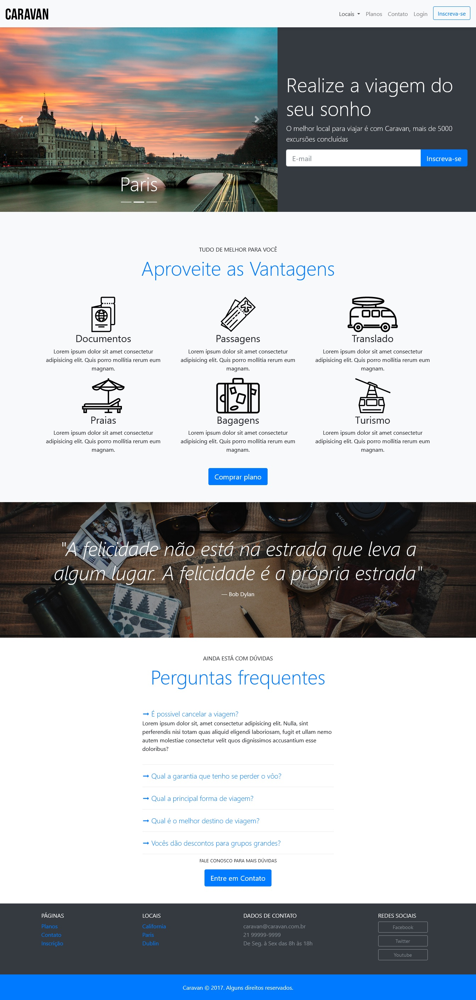

# Caravan 

O site caravan.com foi desenvolvido durante o curso de Bootstrap 4 da Origamid. <br>

## 📖 Sobre

O Caravan é um site de viagem no qua você tem três opções de viagem.
Nele temos tela de cadastro, para escolher entre dois planos Gold ou Platinum.
Opções de pagamento por boleto ou cartão de crédito.
Tela de contato e perguntas frequentes.
### 🔧 Tecnologias Utilizadas

- HTML5
- CSS3
- JavaScript
- Jquery
- Bootstrap 4

### ⚙️ Como executar o projeto

```
# Clonar o repositório
git clone https://github.com/Hellom-word/caravan

# Entrar no diretório
cd caravan
```

## 🖥️ Preview



<br>
<br>
<br>

⌨️ com 💜 por [Hellom Mendes](https://gist.github.com/Dev-Oliveira) 👦
